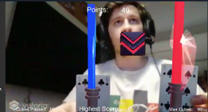
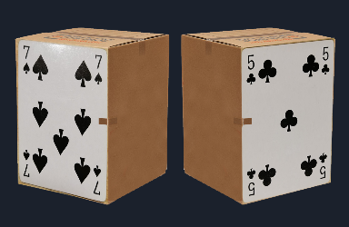

# AlphaBlades
AlphaBlades is an Augmented Reality Rythm game made with Unity, BeatSaber-like. Two players will have to hit as much boxes as possible with their AR light sabers, reaching the highest score possible, before the maximum number of boxes have passed through the screen.

## How to Play
Get the 7 of spades and 5 of clover, glue it into a strong surface, connect the camera to the PC and enjoy!
Move the AR light sabers to hit the incoming cubes in the direction they show. Be careful to match the blade color with the cube color!

